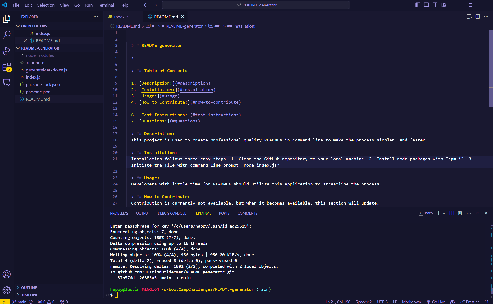

   
  > # README-generator

  > 

  > ## Table of Contents

  1. [Description:](#description)
  2. [Installation:](#installation)
  3. [Usage:](#usage)
  4. [How to Contribute:](#how-to-contribute)
  
  6. [Test Instructions:](#test-instructions)
  7. [Questions:](#questions)

  > ## Description:
  This project is used to create professional quality READMEs in command line to make the process simpler, and faster.

  > ## Installation:
  Installation follows three easy steps. 1. Clone the GitHub repository to your local machine. 2. Install node packages with "npm i". 3. Initiate the file with command line prompt "node index.js"

  > ## Usage:
  Developers with little time for READMEs should utilize this application to streamline the process.
  
  > ## How to Contribute:
  Contribution is currently not available, but when it becomes available, this section will update.
  
  > 

  > ## Test Instructions:
  No tests are currently present.
  
  > ## Questions:
  If you have any question please [JustindHolderman](https://github.com/JustindHolderman) or send me an email to: justindholderman@gmail.com
      

 

 https://app.screencastify.com/v2/manage/videos/ohNhuxj9CiggyseEazPH
